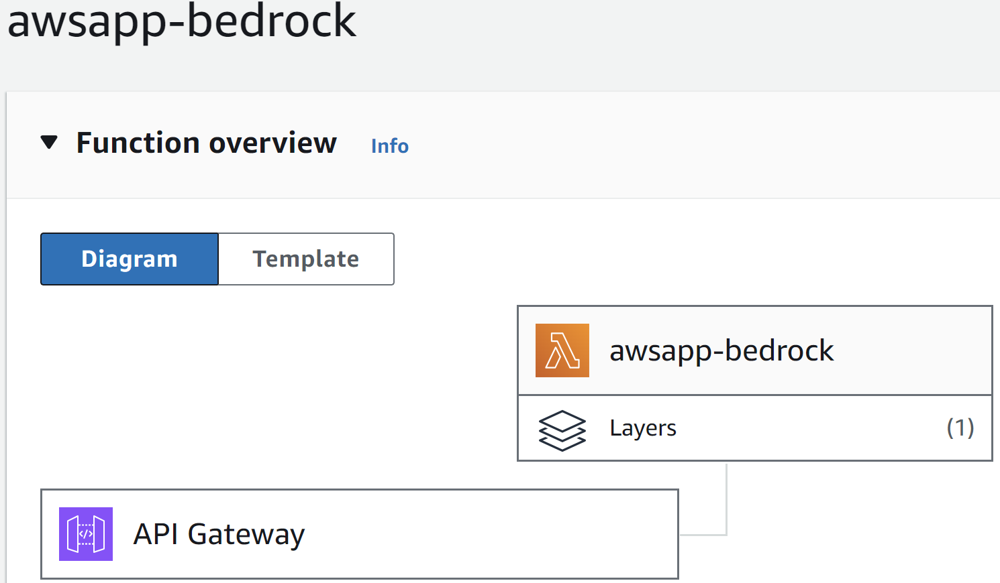
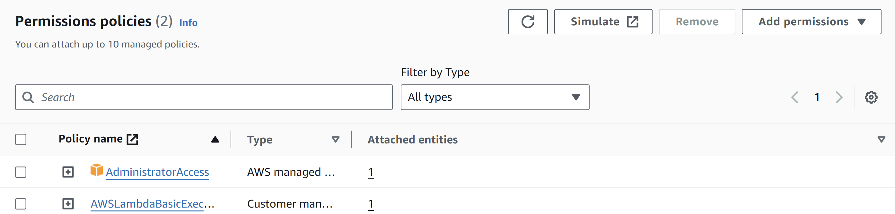
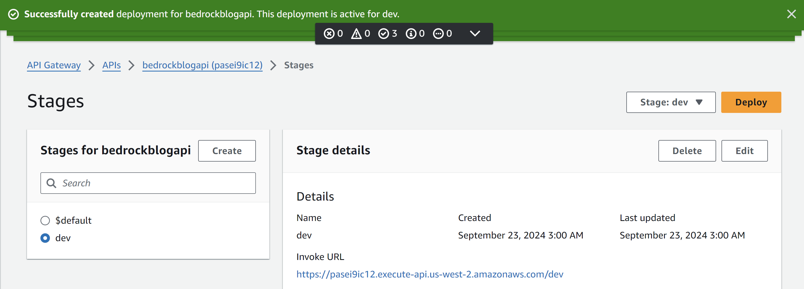
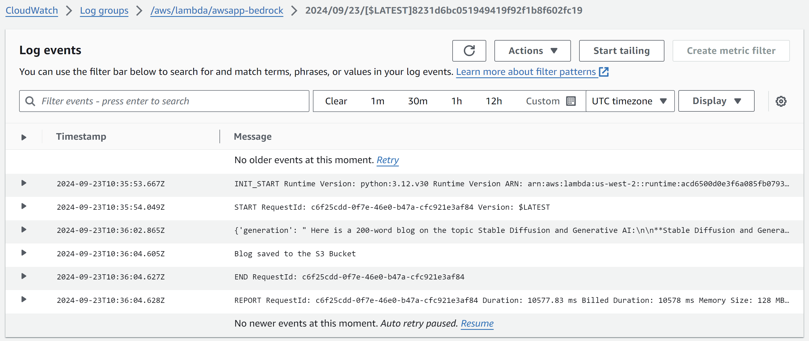
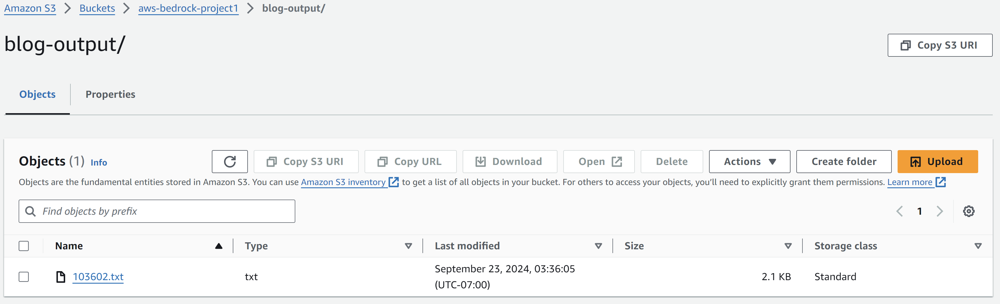
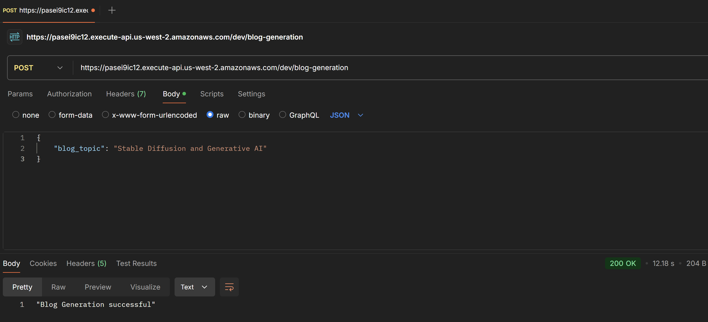

# Generative AI AWS Application - Blog Generator
A Machine Learning application implemented and deployed on the AWS cloud, leveraging its AWS Bedrock tool to utilize the Llama 3 8B Instruct LLM.

## Application Diagram

1. Lambda Function: Triggered when a POST request is received with the blog's subject embedded in the body of the request.
   * Boto Layer: Added to the Function containing the latest version of Python's Boto3 library
2. API Gateway: Linked to the Lambda function to trigger it when an API request is received. Configured to listen to POST requests.
3. AWS Bedrock: Invoked by the Lambda function to access a Foundation Model (Llama 3 8B Instruct) using the Boto3 client. Receives requests with a prompt for the use case and returns a response.
4. S3 Bucket: Stores the final generated output - the blog content as a txt file.

### Lambda Function Permissions

The IAM Role assigned to the Lambda Function requires all permissions (admin privileges) to invoke the Bedrock Client, or the application fails.

### API Gateway

A stage named dev is created and deployed to activate the URL that invokes the Gateway application when sending the POST request.

### Cloudwatch Logs

AWS Cloudwatch logs all the relevant data when the event triggers the Lambda function and is a useful tool to debug any errors.

### S3 Storage

As indicated in the Cloudwatch logs, the generated blog content is stored in the S3 bucket as a txt file.

### POSTMAN API Call

The Postman client is used to make an API POST request call and trigger the Lambda Function
